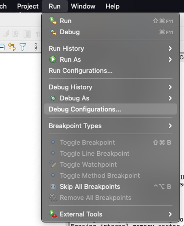
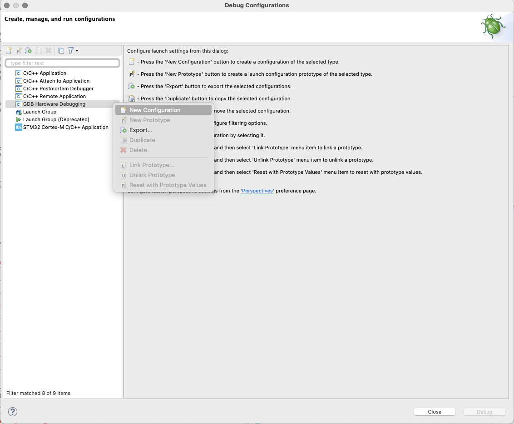
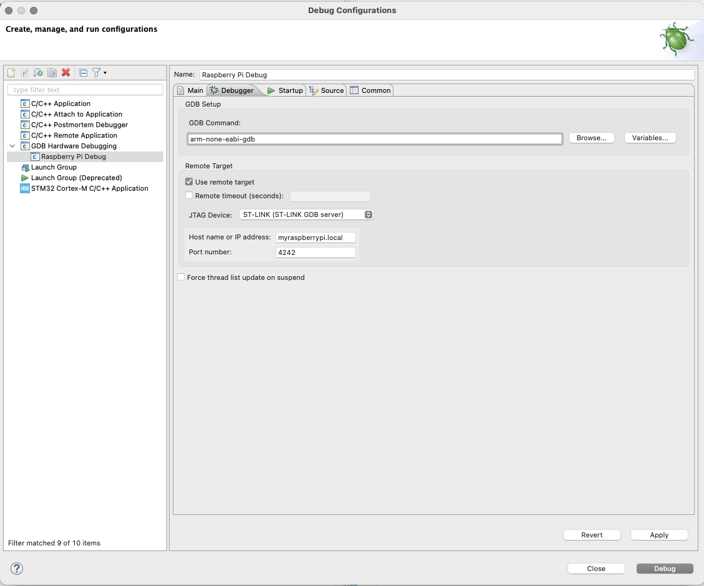
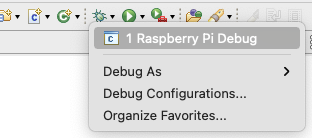
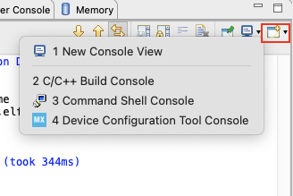
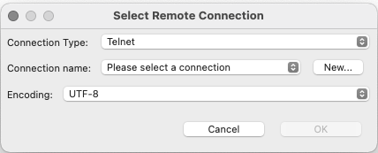
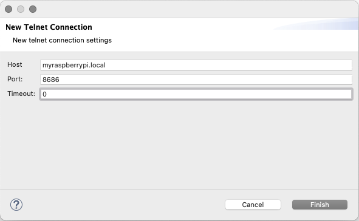

# remote-stm32 Client Configuration #

## Prerequisites ##

* Computer with STM32CubeIDE (or any Eclipse-based IDE)
* [arm-none-eabi-gdb](https://developer.arm.com/tools-and-software/open-source-software/developer-tools/gnu-toolchain/gnu-rm/downloads) 
*Note that the version in package managers is quite outdated because [they stopped updating it](https://launchpad.net/gcc-arm-embedded). You should instead use the version hosted on their website.* 
* Network access to the GDB server

## Configuration ##

### Debugging ###

1. Open STM32CubeIDE and go to Run > Debug Configurations

2. Create a new GDB Hardware Debugging configuration by right-clicking the entry "GDB Hardware Debugging" and selecting "New Configuration"

3. Under the Debugger tab, change the following fields:
    * GDB Command should be `arm-none-eabi-gdb`
    * Check the Remote Target box
    * Change the JTAG Device to ST-LINK (ST-LINK GDB Server)
    * Fill in the Host Name or IP Address and Port fields -- the default port is 4242, consult the server host to determine the IP address

4. Apply this configuration by pressing the 'Apply' button, and then press the 'debug' button (even if you don't actually want to debug). Exit out of the debugging session.

5. To debug, click the down-arrow to the right of the debug button and select the new debug configuration

### UART/Serial ###

To connect to the UART interface through STM32CubeIDE:

1. While in the debug perspective, open a console tab. Select Open Console > Command Shell Console

2. In the Select Remote Configuration window, choose a connection type of Telnet, and an encoding of UTF-8. 
We'll get the actual connection details in the next step.

3. In that same window, create a new connection, with the host being the IP of the Raspberry Pi, and port 8686. 

4. Finish the new connection and press OK on the original pop-up. 
You should now see a connection message in the console window to the effect of "Connected to myraspberrypi on port 8686 [...]".

5. To disconnect, press the red N-looking button in the console window. 

Alternatively, you can use your terminal program of choice and `telnet` directly:

1. Connect to the Raspberry Pi on port 8686: `telnet myraspberrypi.local 8686`

2. You should see a banner identifying the Raspberry Pi, the serial device, and serial connection details. 

Either way you choose, you are now connected to the UART interface that is connected to the STLink. 
This interface varies by device -- check the datasheet to see which UART you should send debugging data to. 

## Troubleshooting ##

**I get the error "I'm sorry Dave, I can't do that. Symbol format 'elf32-littlearm' unknown"**

Make sure you specified that the debugger should use `arm-none-eabi-gdb`, not just plain old `gdb`

**I get the error "Non-stop mode requested, but remote does not support non-stop"**

Yeah, this is a weird one. The answer is that you're using the STM32 Application debug, not the GDB Hardware Debugging. 
Switch to the vanilla GDB Hardware Debugging and you should be all set.

Incidentally, the setting for GDB non-stop mode in Preferences doesn't seem to do a thing. 
I'm still working on this, but for now, you probably won't be able to use SWO. Sorry. 

**I get the error "Operation timed out"**

This could be caused by a number of things. 
Make sure that the server details are entered correctly, if this is the first time to connect.

Make sure that you are the only one attempting to debug: only one connection to the GDB server can be active at a time!

Finally, try bugging the person hosting the server to check if it's actually up.

**I get the error 'Port already in use'!**

Someone else is currently accessing the serial port -- like the GDB server, only one connection can be active at a time.

**I just get gibberish while using telnet!**

This is likely caused by a baud mismatch. 
By default, the server listens at 115200 baud. 
If you can't or won't use this baud rate, the server host will need to reconfigure it to listen to your new and improved baud rate.  

**[Insert complaint here]!**

Submit an [issue](https://github.com/eosti/remote-stm32/issues)!
